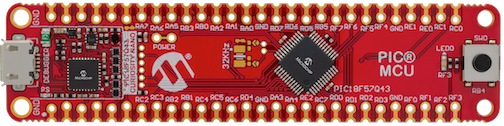
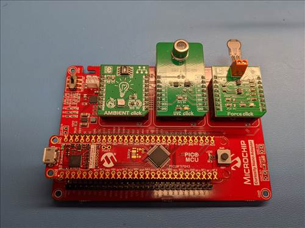
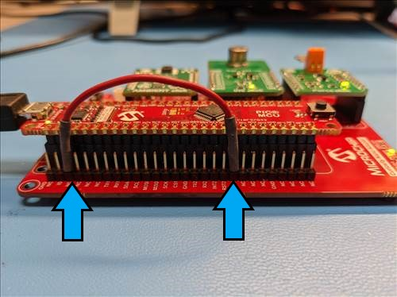
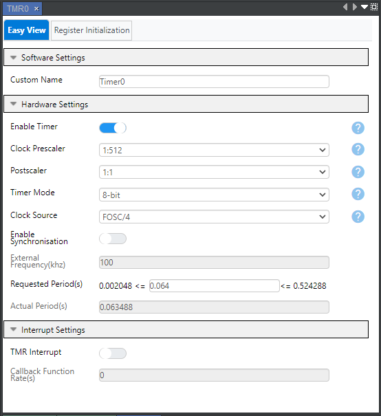
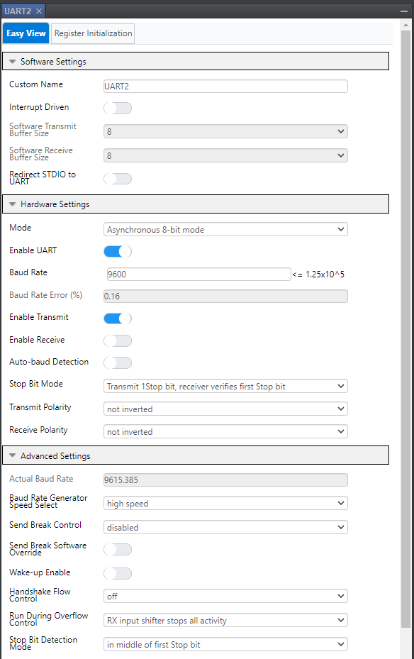

<!-- Please do not change this logo with link -->

[](https://www.microchip.com)

# PIC18F57Q43-curiosity-adcc-3-dma-mplab-melody

This project highlights the use of the PIC18-Q43 family’s DMA peripherals to swap the context of the ADCC on the fly. One channel of DMA copies out the current context of the ADCC, a second channel copies in a new conversion configuration, and a third copies in the next channel's context. The ADCC conversion is triggered by TMR0, and the ADCC conversion-complete triggers all DMA channels. Priority is assigned to the DMA transfers using the system arbiter, so that the DMA operate in the correct order.

## Related Documentation
- [PIC18F-Q43 Family Product Page](https://www.microchip.com/design-centers/8-bit/pic-mcus/device-selection/pic18f-q43-product-family)

## Software Used
- MPLAB® X IDE 6.00.0 or newer [(MPLAB® X IDE 6.00)](https://www.microchip.com/en-us/development-tools-tools-and-software/mplab-x-ide?utm_source=GitHub&utm_medium=TextLink&utm_campaign=MCU8_MMTCha_MPAE_Examples&utm_content=pic18f57q43-curiosity-adcc-3-dma-mplab-melody-github)
- MPLAB® XC8 2.32.0 or newer compiler [(MPLAB® XC8 2.32)](https://www.microchip.com/en-us/development-tools-tools-and-software/mplab-xc-compilers?utm_source=GitHub&utm_medium=TextLink&utm_campaign=MCU8_MMTCha_MPAE_Examples&utm_content=pic18f57q43-curiosity-adcc-3-dma-mplab-melody-github)
- MPLAB® X MCC 5.xx or newer [(MPLAB® X Melody 5.xx)](https://www.microchip.com/en-us/tools-resources/configure/mplab-code-configurator)

## Hardware Used
- PIC18F57Q43 Curiosity Nano [(DM164150)](https://www.microchip.com/en-us/development-tool/DM164150)
- Curiosity Nano Base for Click boards™ [(AC164162)](https://www.microchip.com/Developmenttools/ProductDetails/AC164162)
- Ambient Light Click board™ [(MIKROE-1890)](https://www.mikroe.com/ambient-Click)
- UVC Click board™ [(MIKROE-4144)](https://www.mikroe.com/uvc-Click)
- Force Click board™ [(MIKROE-2065)](https://www.mikroe.com/force-Click)
- Jumper wire
- USB cable

## Setup
The Curiosity Nano Adapter Board (DM164150) with the Curiosity Nano Base for Click Boards (AC164162) as the development platform. The Nano Base board has three MikroElektronika Click board slots, several types of power connections, voltage regulation circuitry, and a header mount for the Nano Development board. For this project the Nano Base board is loaded with an ambient light Click, an ultraviolet light Click, and a force sensing Click. *Note:* Any Click boards with analog output can be used for this project; this collection was selected based on availability.

The hardware is assembled by soldering the male and female pin headers to the Nano Base; the headers are included with the base. The pin headers supplied with the Curiosity Nano are used to mount the Curiosity board to the Nano Base, and the Click boards are installed into the Click sockets on the Nano base.

The ambient light Click uses the MLX75305 light sensor and the Click board has been configured for 3.3V operation by soldering the 0 ohm jumper to the 3.3V selection. *Note:* the sensor can also be run at 5.0V, it was received with the 3.3v selection.

The ultraviolet light Click uses the GUVC-T21GH UV sensor and the Click board has been configured for 3.3V operation by soldering the 0 ohm jumper to the 3.3V selection, and for analog output by soldering a jumper on the JP2 location; the on-board ADC is not used. *Note:* the sensor can also be run at 5.0V, it was received with the 3.3v selection.

The force Click uses a sensor employing pressure sensitive resistive ink to create a physical compression sensor. This sensor also has the option to run from either 3.3V or 5V. As above, the sensor was run at 3.3V because it was shipped with that option enabled. The force Click also contains a range selection option where, again, the default shipped with the sensor was used.

A single jumper wire between the device UART and the Nano serial Rx is also needed for the project. The Serial Jumper Setup picture below shows the connection between RD0 and the Rx input on pin 3 of the Nano.

### Curiosity Nano Development Board:


### Click Board Setup:


### Serial Jumper Setup:


## Operation

Connect the Curiosity Nano using a USB cable to a host PC. This will allow the MPLAB X IDE to program and debug the project software, and will provide a serial terminal port for light and force data to be sent from the sensors. When connected, information about the Curiosity Nano will be displayed in the MPLAB X Kit Window. A terminal emulator can open a connection to the serial port, configured as 9600-8-N-1. *Note:* A terminal emulator is included in the Data Visualizer plug-in available for MPLAB X.

The program will repeatedly send lines of text with three 16-bit hexadecimal numbers. With the Click boards installed as shown above, the first number is the ambient light level, the second is the ultraviolet light level, and the third is the force on the sensor. All of the numbers will be in the range of 0x0000 to 0x0FFF as shown in the following example, because the Q43 has a 12-bit ADC.

```c
0x0C9F, 0x010C, 0x0176
0x0C6C, 0x01A1, 0x0181
0x0BDE, 0x012A, 0x01AE
0x0B6E, 0x00F8, 0x01D4
0x0AA8, 0x0166, 0x01C8
```

# Project Software Configuration:
The project software was developed in MPLAB X with the help of the MPLAB Melody Configurator plug-in tool. Melody provides an user-friendly interface that generates software based on the user’s parameters. Melody allows developers who may not be familiar with a new peripheral a way to quickly set up and test a peripheral without having to dive deep into the device datasheet. For this project, Melody was used to generate code for the TMR0 and ADCC modules.

*Note:* the configuration of the ADCC used Melody, but the project does not include the configuration, instead the configuration is compiled into a data array that is the source for the DMA.

The output of the ADCC is converted to ASCII and transmitted through the UART to the serial port on-board the Nano.

## TMR0 Configuration:
The TMR0 module is configured such that the output period is 64 ms, which will provide a 15 Hz ADCC sample rate. The clock source is Fosc/4, operating at 1MHz with a 512:1 prescaler. The slow sample rate was used to provide sufficient time for the serial transmit time for each 16 bit number. 6 digits of ascii (0x1234) + comma and space = 8 characters (10 bits) or 80 bits at 9600 or 8.3ms.

### Melody TMR0 Editor Window:


```c
void TMR0_Initialize(void)
{
    TMR0H = 0x1E;         //TMR0H 30;
    TMR0L = 0x0;          //TMR0L 0;
    T0CON1 = 0x59;        //T0CS FOSC/4; T0CKPS 1:512; T0ASYNC not_synchronised; 
    PIR3bits.TMR0IF = 0;  //Clear interrupt flag
    T0CON0 = 0x80;        //T0OUTPS 1:1; T0EN enabled; T016BIT 8-bit; 
}
```

## UART Configuration:
The UART module is configured to provide a 9600 baud serial interface for display of the ADCC conversion values.
*Note:* To connect the UART to the on-Nano serial connection, a jumper wire is needed between pins 3 and 20 of the Nano. This connects the UART TX pin to the Nano RX.

### Melody UART Editor Window:


```c
void UART2_Initialize(void)
{
    // Disable interrupts before changing states
    // Set the UART2 module to the options selected in the user interface.
    U2P1L = 0x00;    // P1L 0;
    U2P2L = 0x00;    // P2L 0;
    U2P3L = 0x00;    // P3L 0;
    // BRGS high speed; MODE Asynchronous 8-bit mode; RXEN enabled; TXEN enabled; ABDEN disabled;
    U2CON0 = 0xB0;
    // RXBIMD Set RXBKIF on rising RX input; BRKOVR disabled; WUE disabled; SENDB disabled; ON enabled;
    U2CON1 = 0x80;
    // TXPOL not inverted; FLO off; RXPOL not inverted; RUNOVF RX input shifter stops all activity; STP Transmit 1Stop bit, receiver verifies first Stop bit;
    U2CON2 = 0x00;
    U2BRGL = 0xCF;    // BRGL 207;
    U2BRGH = 0x00;    // BRGH 0;
    // STPMD in middle of first Stop bit; TXWRE No error;
    U2FIFO = 0x00;
    // ABDIF Auto-baud not enabled or not complete; WUIF WUE not enabled by software; ABDIE disabled;
    U2UIR = 0x00;
    // ABDOVF Not overflowed; TXCIF 0; RXBKIF No Break detected; RXFOIF not overflowed; CERIF No Checksum error;
    U2ERRIR = 0x00;
    // TXCIE disabled; FERIE disabled; TXMTIE disabled; ABDOVE disabled; CERIE disabled; RXFOIE disabled; PERIE disabled; RXBKIE disabled;
    U2ERRIE = 0x00;
    UART2_SetFramingErrorHandler(UART2_DefaultFramingErrorHandler);
    UART2_SetOverrunErrorHandler(UART2_DefaultOverrunErrorHandler);
    UART2_SetErrorHandler(UART2_DefaultErrorHandler);
    uart2RxLastError.status = 0;
}
```

## adConfig[n] configuration and data arrays:
The configuration data table is an N-element GPR array; for this project N=3. There is one configuration for each of the three sensors, but any number of configurations may be provided. NUM_ADCONFIG will be determined by the compiler and each element is preloaded with the appropriate configuration values. The data structure members have a 1:1 correspondence with the special function registers (SFR) in the ADCC. The configuration data includes the channel selector, acquisition and precharge times, and other parameters.

*Note:* Some elements, like ADACQ, are shown as 16-bit members. These correspond to two 8-bit SFRs in the ADCC register map that are accessed using two 8-bit data transfers in little-endian order. This is a feature of many PIC register maps. 

```c
typedef struct adConfig_s
{
    uint8_t  cADPCH;     /// ADC channel to convert
    uint8_t  cADNCH;     /// Used only with differential ADC
    uint16_t cADACQ;     /// Pre-conversion acquisition time
    uint8_t  cADCAP;     /// Additional capacitance selector
    uint16_t cADPRE;     /// Pre-acquisition precharge time
    uint8_t  cADCON0;    /// Control register 0
    uint8_t  cADCON1;    /// Control register 1
    uint8_t  cADCON2;    /// Control register 2
    uint8_t  cADCON3;    /// Control register 3
    uint8_t  cADSTAT;    /// Conversion status
} adConfig_t;

// configuration data table; parameters not specified here will be zero.
adConfig_t adConfig[] = { // note that ADPCH is octal
    { .cADPCH = 000, .cADACQ = 0x64, .cADCON0 = 0x84, .cADCON2 = 0x04, },
    { .cADPCH = 001, .cADACQ = 0x64, .cADCON0 = 0x84, .cADCON2 = 0x04, },
    { .cADPCH = 002, .cADACQ = 0x64, .cADCON0 = 0x84, .cADCON2 = 0x04, },
};
#define NUM_ADCONFIG    (sizeof(adConfig)/sizeof(adConfig[0]))
```

## adContext[n] context data arrays:
The context data table provides storage for the ADCC contexts. There is one context storage element for each configuration element and all are initialized to zero. The data structure members have a 1:1 correspondence with the special function registers in the ADCC. Context data includes computation thresholds, repetition count, and accumulator value as well as the most-recent conversion result.

```c
typedef struct adContext_s
{
    uint16_t cADLTH;    /// Lower threshold
    uint16_t cADUTH;    /// Upper threshold
    uint16_t cADERR;    /// Calculated error
    uint16_t cADSTPT;   /// Setpoint
    uint16_t cADFLTR;   /// Filtered results
    uint24_t cADACC;    /// Accumulator
    uint8_t  cADCNT;    /// Sample counter
    uint8_t  cADRPT;    /// Repetition count
    uint16_t cADPREV;   /// Previous measurement
    uint16_t cADRES;    /// Current measurement
} adContext_t;

// context data table, preloaded with zeros.
volatile adContext_t adContext[NUM_ADCONFIG] = { {0} };
```

## DMA1 Configuration:
The DMA1 peripheral is used to transfer the most-recent context data from the ADCC following a conversion. It is triggered by the ADCC conversion complete signal and has the highest priority in the arbiter. Context data from the ADCC context registers is placed into the context data array adContext[n], where n changes from zero to (NUM_ADCONFIG-1), storing the calculations to be recalled later.

## DMA2 Configuration:
The DMA2 peripheral is used to transfer a new configuration into the ADCC prior to a conversion. It is triggered by the ADCC conversion complete signal and has the second highest priority in the arbiter; DMA2 operates when DMA1 is complete. Configuration data is taken from the configuration array adConfig[n]. This DMA will be triggered by software to set the ADC configuration for the first conversion.

## DMA3 Configuration:
The DMA3 peripheral is used to transfer previous context data to the ADCC before a conversion. It is triggered by the ADCC conversion complete signal and has the lowest priority of the three DMAs; DMA3 operates when DMA2 is complete. Context data is taken from the context data array adContext[n] and placed into the ADCC context registers allowing the calculations to continue from the previous state. This DMA will be triggered by software to load the first ADCC context.

```c
#define VIEW_DMA(n) do{DMASELECT=((n)-1);}while(0)
#define UINT24_FROM_PTR(p)    ((uint24_t)(uintptr_t)(p))
#define UINT16_FROM_PTR(p)    ((uint16_t)(uintptr_t)(p))
void DMAforADC_Initialize(void)
{
	/* Set up DMA1 to copy the ADC control SFRs into the context cache. */
    VIEW_DMA(1); // Select DMA1
    DMAnCON0  = 0x00; // all configuration must take place with DMAEN=OFF
    DMAnSSA   = UINT24_FROM_PTR(&ADLTHL); // copy from hardware SFRs
    DMAnSSZ   = sizeof(adContext[0]);     // source size is just the necessary SFRs
    DMAnDSA   = UINT16_FROM_PTR(adContext); // first cache location
    DMAnDSZ   = sizeof(adContext);          // using the full cache
    DMAnSIRQ  = 0x0A; // transfer trigger is AD conversion complete
    DMAnAIRQ  = 0x00; // abort trigger is nil
    DMAnCON1  = 0x42; // GPR is source, increment DPTR and SPTR
    DMAnCON0  = 0xC0; // enable, hardware trigger, no abort

	/* Set up DMA2 to copy the context cache into the ADC control SFRs. */
    VIEW_DMA(2); // Select DMA2
    DMAnCON0  = 0x00; // all configuration must take place with DMAEN=OFF
    DMAnSSA   = UINT24_FROM_PTR(adContext); // begin copying from start of cache
    DMAnSSZ   = sizeof(adContext);          // using the full cache
    DMAnDSA   = UINT16_FROM_PTR(&ADLTHL); // copy to hardware SFRs
    DMAnDSZ   = sizeof(adContext[0]);     // just the necessary SFRs
    DMAnSIRQ  = 0x0A; // transfer trigger is AD conversion complete
    DMAnAIRQ  = 0x00; // abort trigger is nil
    DMAnCON1  = 0x42; // GPR is source, increment DPTR and SPTR
    DMAnCON0  = 0xC0; // enable, hardware trigger, no abort

	/* Set up DMA3 to write a new configuration to the ADC SFRs. */
    VIEW_DMA(3); // Select DMA3
    DMAnCON0  = 0x00; // all configuration must take place with DMAEN=OFF
    DMAnSSA   = UINT24_FROM_PTR(adConfig); // begin copying from start of cache
    DMAnSSZ   = sizeof(adConfig);          // using the full cache
    DMAnDSA   = UINT16_FROM_PTR(&ADPCH); // copy to hardware SFRs
    DMAnDSZ   = sizeof(adConfig[0]);     // just the necessary SFRs
    DMAnSIRQ  = 0x0A; // transfer trigger is AD conversion complete
    DMAnAIRQ  = 0x00; // abort trigger is nil
    DMAnCON1  = 0x42; // GPR is source, increment DPTR and SPTR
    DMAnCON0  = 0xC0; // enable, hardware trigger, no abort

    /* Unlock the arbiter to set the DMA priorities. Different values are
     * used to make sure that the transfers happen in proper order
     * since they are all triggered from the ADC-complete interrupt:
     * 1. copy the (now updated) math context to cache
     * 2. install the context for the next sample, and
     * 3. load the configuration for the next sample, including
          the channel number, acquisition timing, and ADCC mode. */
	asm ("BANKSEL PRLOCK");
    asm ("MOVLW 0x55");
    asm ("MOVWF PRLOCK");
    asm ("MOVLW 0xAA");
    asm ("MOVWF PRLOCK");
    asm ("BSF PRLOCK, 0");
	DMA1PR = 0; //set DMA1 to highest priority (context read)
	DMA2PR = 1; //set DMA2 to next highest priority (context write)
	DMA3PR = 2; //set DMA3 to just above interrupt (config write)
}
```

## main loop and UART functions:
After initializations, the main program is responsible for pulling the data from the adContext array and formatting it for serial transmission. DMA2 and DMA3 are manually run once at startup to preload the ADCC for the first conversion, moving the DMA index to the second config/context set in the array. A conversion is triggered by TMR0 roll over, and ADC completion then triggers the DMA data transfers in the order defined by priority.

*Note:* The DMA interrupt flag is polled from the main routine because data is transmitted serially, which would make the interrupt take a very long time to complete. Without the requirement to transmit serially, an interrupt service routine could be used to capture the data from adContext[n].

```c
void main(void)
{
    SYSTEM_Initialize();    // Melody peripheral configuration and startup

    T0CON0bits.EN = 0;      // pause the timer during set-up
	DMAforADC_Initialize(); // Setup DMA to perform ADC context switch
    
    /* Two of the DMA are used to load ADC registers (the 3rd reads
     * registers). Trigger register loading now to initialize the ADC
     * for the first measurement. */
    VIEW_DMA(2);          // select DMA2 (for adcontext)
	DMAnCON0bits.DGO = 1; // trigger DMA2 to load context for channel 0
    VIEW_DMA(3);          // select DMA3 (for adconfig)
	DMAnCON0bits.DGO = 1; // trigger DMA3 to load configuration for channel 0

    T0CON0bits.EN = 1;      // start the timer to trigger the ADC

    while(1) // Main while-one loop
    {
        /* Enter after DMA1 has completed the data fetch. */
        if (0 != PIR2bits.DMA1SCNTIF)
        {
            /* Track the ADC progress using a counter. 
             * Configuration #0 was loaded during initialization. */
            static uint8_t dmaStage = 0;
            
            /* Clear the flag and capture the result. */
            PIR2bits.DMA1SCNTIF = 0;
            uint16_t adc_result = adContext[dmaStage].cADRES;

            /* Send the result */
            Serout(dmaStage, adc_result);

            /* Advance and validate the stage counter */
            dmaStage++;
            if (dmaStage >= NUM_ADCONFIG) dmaStage = 0;
        }
    }
}
```

```c
// Function to print out 0x followed by a 16-bit hex number
void Serout(uint8_t index, uint16_t valu)
{
	uint8_t	 cntr;
	uint16_t temp;

    /* A little bit of formatting for the serial output
     * then send the result. */
    if (0 == index) EOL();  // new line
    else CDT();             // comma

	UART_Write('0'); // print "0x" at start of line
	UART_Write('x');
	for	(cntr=0; cntr<4; cntr++)           // print 4 hex digits of 16-bit value
	{
		temp = (valu & 0xF000);            // Convert most significant nibble to ASCII
		temp = temp >> 12;
		temp += '0';
		if (temp > '9') temp += 7;
		UART_Write(temp & 0xFF);           // Send the nibble
		valu = valu << 4;
	}
}
```

```c
// Send the end of line CR/LF
void EOL(void)
{
	UART_Write(CR);                       // send CR
	UART_Write(LF);                       // send LF
}

// Send comma and space between values
void CDT(void)
{
	UART_Write(',');                      // send ,
	UART_Write(' ');                      // send space
}

static void UART_Write(char c)
{
    while (UART2_IsTxReady() == 0);  // Wait for UART to be idle
	UART2_Write(c);
}
```

## System Configuration:
Melody can be used to configure basic system parameters, such as oscillator selection and I/O pin configuration.
Once all project parameters have been configured, simply press the ‘Generate’ button, and Melody will generate the drivers based on user inputs.

*Note:* Because the ADCC is configured using the config/data array and the two DMA channels, the  Melody configuration of the ADCC can be ignored.

# Conclusion:
This project uses the PIC18F57Q43 microcontroller’s TMR0, UART, ADCC, and three DMA modules to create an automated data collection system that can still take advantage of the computational capabilities of the ADCC.
